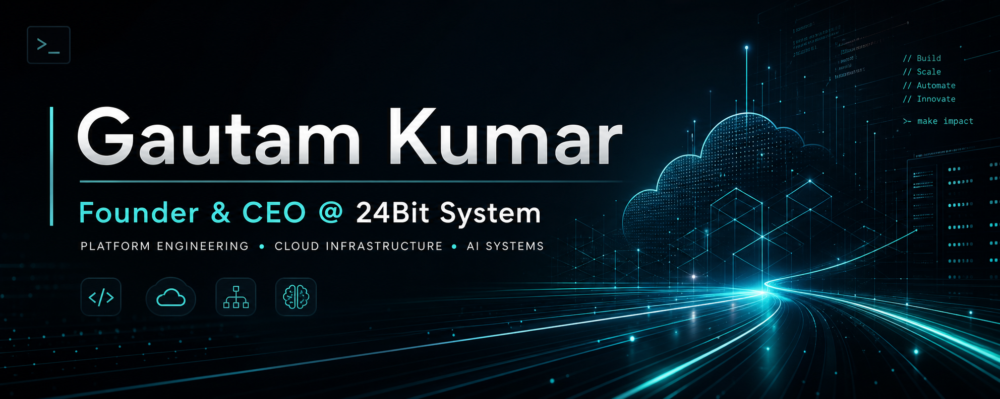

  

# Gautam Kumar

### Founder & CEO @ 24Bit System

Software Engineer • Platform Engineering • Cloud Infrastructure • AI Systems

[LinkedIn](https://www.linkedin.com/in/thegautamkumar/) • [GitHub](https://github.com/GautamKumarOffical)

## About

I build practical software across platform engineering, cloud infrastructure,
AI workflows, and developer tooling.

I care about systems that are fast to ship, clean to operate, and strong enough
to support real products in production.

**Languages and tools:** Go, Python, Rust, TypeScript, Tauri

## Focus

- AI agent workflows and coding systems
- Platform engineering foundations
- Cloud-native application architecture
- Internal tooling for developer productivity
- Terminal-first and desktop developer experiences

## Working Style

- Architecture before noise
- Practical execution over hype
- Clean systems over clever systems
- Tooling that improves team speed
- Product thinking paired with engineering depth

## Interests

- AI engineering
- Platform engineering
- Cloud architecture
- Developer experience
- CLI and desktop tooling
- Open-source systems

Open to collaboration around AI products, platform systems, cloud tools, and developer workflows.
